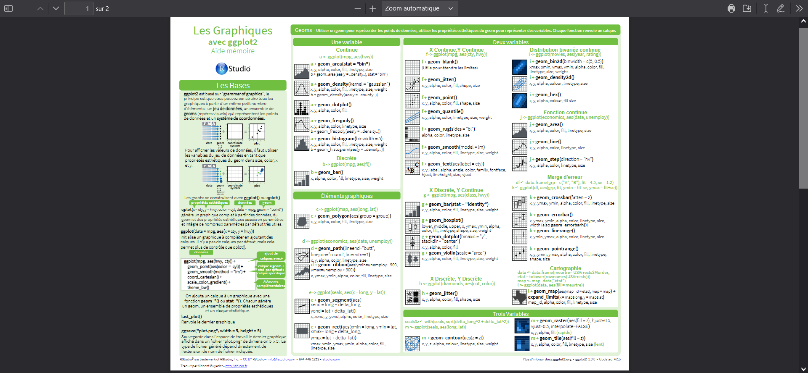

------------------------------------------------------------------------

---
title: "Projet GGPLOT2"
author: "38001470 VIRY Brandon &  40007818 Chahalane Bériche"
date: '2022-11-21'
output:
  pdf_document: default
  html_document: default
---

```{r setup, include=FALSE}
knitr::opts_chunk$set(echo = TRUE)
```

# GUIDE UTILISATION GGPLOT 2

# **SOMMAIRE**

-   Introduction (1)

-   Prérequis (2)

-   Syntaxe de base

    -   Récupération de données (2)
    -   Les Géométries et mappages obligatoire (2)
    -   Les mappages optionnelle (2)
    -   Attribut de représentation (1)
    -   Multigraphe (1)
    -   Faceting (1)
    -   Scales (2)
    -   Theme (1)

-   Exemple :

    -   Exemple 1 (1)

    -   Exemple 2 (2)

-   Aller Plus loin (1)(2)

-   Conclusion (1)

**(1) Bériche** **(2) Brandon**

# Introduction

Bienvenue dans ce guide d'utilisation de **GGplot2**, Qu'est-ce que ggplot2 (souvent abrégé sous le nom de ggplot) ?

GGplot2 est une **extension** du tidyverse (collection de packages R open source) sortie en 2007 qui permet de générer des **graphiques** avec une syntaxe cohérente et puissante, c'est un **package** très complet et très célèbre, parmi les utilisateurs de **R**.

GGplot repose sur les principes de la **"grammaire des graphiques"**. L'idée principale est de concevoir un graphique comme une succession de **couches** (layers, en anglais) qui se superposent.

Une des particularités de ggplot2 est qu'elle part du principe que les données relatives à un graphique sont stockées dans un **tableau de données** (data frame, tibble ou autre).

Dans ce guide nous allons vous accompagner et vous introduire à l'utilisation de ce package ,malgrés l'aide fournis il faudra préalablement des **prérequis** afin de facilement comprendre et suivre ce tuto de façon la plus optimal. Ensuite vous verrez les différentes **syntaxe** , nous vous donnerons 2 exemple de cas d'utilisation et pour **conclure** on vous donnera les **ressources** nécessaire pour aller plus loin dans votre **apprentissage**.

Malgrés l'effort et le travail fournit pour vous donnez un guide de qualité on arrivera pas à concurrencer votre meilleur allié qui sera la fonction **" help()"** qui vous sera quasiment indispensable dans votre apprentissage !!!

[**Deux differrente façon d'uttiliser la fonction help()**]{.underline}

```{r}
#on va tester help sur la package ggplot2
#1ere methode :
help("ggplot2")

#2ieme methode:
?ggplot2

```

```{r}
#install.packages("ggplot2")
library("ggplot2")

```

Pour les exemples qui vont suivre, nous allons utiliser le jeu de données mpg disponible dans le package ggplot2

```{r}
data(mpg,package = "ggplot2")#on charge les donnée
?mpg
head(mpg)
str(mpg)
```

# **Prérequis**

Pour pouvoir utiliser ce guide **il faut maîtriser le langage de programmation R** il faut avoir installé sur sa machine **r studio** installer la librairie  **ggplot2** et savoir **le type de représentation** qu'on veut faire sur vos données .Si vous avez jamais installer une librairie , utiliser R et Rstudio je vous met en lien un[tutoriel](https://openclassrooms.com/fr/courses/4525256-initiez-vous-au-langage-r-pour-analyser-vos-donnees/6250851-prenez-en-main-r-et-r-studio) expliquant comment utiliser R et Rstudio et je vous expliquer comment installer la librairie ggplot2.

Alors, voici comment il faut installer la librairie ggplot2 :

**Etape 1 : Etape de départ**

[](installeGGPLOT2/Etape%201%20_%20Etape%20de%20départ.png)

**Etape 2: Cliquer sur l'onglet "Pakages"**


**Etape 3 : Sous-onglet "Install"**


**Etape 4 : Parametrage**


**Etape 5 : Install from "CRAN"** 

**Etape 6 : Entrer le nom de la librairie dans "Package" -\> ggplot2**


**Etape 7 : Cocher "install dependencies"**

 **Etape 8 : Cliqué sur "install"**


**Etape 9 : Vérifier que le installation est TERMINER et SANS ERREUR *(voir en bleu sur la photo)***


# Syntaxe de base

## Récupération de données

Pour récupérer les données la plupart du temps vu le nombre de données , les données sont enregistrées   **dans des fichiers**  et le plus souvent ce fichier est dans le format csv  donc je vais vous montrer comment récupérer les données  dans  plusieurs types de fichier . Ces données sont d'un type spécial a R **c'est un** **dataframe** où les **données** de chaque colonnes sont **typées**. mais pour simplifier je vais dire tableau et ou les noms des colonnes sont appelé variable . Voici un exemple :

```{r}


#EXEMPLE 


donner = data.frame(
   identifant = c(1,2,3),
   animal = c("lapin","chien","chien"),
   couleur = c("Rose","Violer","Magenta")
)

donner
```

**1- Simple fichier texte**

```{r}
data <- read.table("data.txt", header = FALSE)
data 
```

```{r}
data <- read.table("data.txt", header = TRUE)
data 
```

**data :** est la variable ou les données vont être sauvegarder (le tableau)

**read.table() :**est la fonction qui prend en argument :

1.  **le nom du fichier** pour l'exemple c'est data.txt sous forme de chaîne de caractère c'est adire entre guillemet "data.txt"

2.  Un argument **header** qui est égale soit à **TRUE ou FALSE**

    1.  **\
        **Si vous mettez header est égale à **TRUE** signifie le fichier **contient les noms des colonne et des ligne de notre du tableau**

    2.  **\
        **Si vous mettez header est égale à **FALSE** signifie **l'inverse**

**2- Un fichier CSV**

```{r}
 base = read.csv(file = "tic-tac-toe.csv",header = FALSE)
 base
```

**read.csv() :** cette fonction est réserver au fichier en **format .csv** et prend en argument:

1.  **le nom du fichier** pour l'exemple c'est tic-tac-toe.csv sous forme de chaîne de caractère c'est a dire entre guillemet "tic-tac-toe.csv"

2.  Un argument **header** qui est égale soit à **TRUE ou FALSE :**

    1.  Si vous mettez header est égalé à **TRUE** signifie le fichier contient les noms **des colonnes et des ligne** de notre du tableau

    2.  Si vous mettez header est égalé à **FALSE** signifie **l'inverse**

Il existe plein d'autres façons aussi de récupérer des données comme l'importation  de **fichier excel ,sas ,spss  et plein d'autres** formats ou encore en faisant **une connexion à des bases de données ou package** .

Maintenant que les données sont récupérées pour pouvoir faire la représentation vous devez d'abord **importer la librairie** que vous avez installé ggplot2 comme suit:

```{r}
library(ggplot2)
```

pouvoir travailler sur c'est donner vous devez **prendre c'est donner est le placer en argument de la fonction ggplot** comme ceci  :

Données exemple :

```{r}
donnerRp = read.csv(file = "donnerRp.csv",header = TRUE)
donnerRp

```

source des données : [( Source )](https://www.offremedia.com/le-temps-consacre-aux-jeux-video-est-estime-7-heures-par-semaine-dans-le-monde-et-en-france-en)

```{r}
ggplot(data= donnerRp)
```

ou

```{r}
ggplot(donnerRp) 
```

Comme vous le voyez il y a juste l'emplacement ou le graphique va s'afficher qui s'affiche c'est tout à fait normal car on ne lui a pas défini de représentation.C'est le prochain point de ce guide .

## Les Géométries

**Les géométries c'est le type de représentation graphique** qu' on veut utiliser sur nos données  il existe beaucoup  de géométrie  chaque géométrie a c'est caractéristique . 

Pour **sélectionner** la représentation que on veut il suffit **d' ajouter un type de graphique**   qui est sous forme de fonction:

```{r}
ggplot(data=donnerRp)   +  geom_point () 
#initialisation donner addition  geom 

```

Comme vous le voyez **les géométries ne peuvent pas être représenter sans un argument** .

**Les géométriques** peuvent avoir en **argument** ce qu' on appelle un **mappage** et **des attribue graphique** (qui est le prochain point à traiter ) . Un **mappages** permet de **relier un élément graphique à une variable** d'un tableau.Il existe presque autant de mappage que il y de attribue graphique. Pour chaque géométrie il existe un mappage différent . Ce **mappage** est défini dans la fonction **aes**() c'est fonction permette de **sélectionner les éléments à utiliser pour la représentation selon les caractéristiques** d'un type de graphique .Certains des **mappages sont obligatoire** pour faire une représentation et des **autres optionnelle** .

Exemple pour une graphique geom_point() avec les éléments de mappage obligatoire :

```{r}
ggplot(data=donnerRp)  + geom_point (aes(x=Heures.moyennes.chaque.semaine , y=Pays )) 
```

-   **aes() :** Cette fonction permet de créer le mappage sur les données (Les mappages esthétiques)

-   **x** est un élément du mappage , c'est l'élément du graphique en x

-   **y** est un élément du mappage ,c'est l'élément du graphique en y 

-   **data1** est la donner pris en compte en x

-   **data2** est la donner pris en compte en y 

il existe beaucoup de  géométrique  on va vous présenter quelques un  avec les mappage obligatoire

## geom_boxplot : 

```{r}
note =read.csv(file = "note.csv",header = TRUE)
note 
```

```{r}
ggplot(note) + geom_boxplot(aes(x=ECTS , y=Note ))
```

-   **x** =a variable quantitative

-   **y** = variable quantitative

## geom_violin

**RQ** : geom_violin et geom_boxplot sont des façon de visualiser très proches

```{r}
ggplot(note) + geom_violin(aes(x=ECTS , y=Note))
```

-   **x** =a variable quantitative

-   **y** = variable numérique\

## geom_bar 

```{r}

ggplot(note) + geom_bar(aes(x=Note  ))
```

-   **x**  ou **y** = la variable quantitative

-   **x** si on veut représenter verticalement 

-   **y** si on veut représenter horizontalement

Vous pouvez aussi passer du format vertical horizontal et vice-versa en ajoutant la fonction **coord_flip()**   à la géométrie :

```{r}
ggplot(note) + geom_bar(aes(x=Note  ))+coord_flip()

```

**RQ** : coord_flip() que s'appliquer à toute les type de représentation de ggplot 2 \

## geom_col

```{r}
ggplot(note) + geom_col(aes(x=Note ,y=COUR ))
```

-   **x** =variable numérique

-   **y** = le nom ou autre variable numérique

    \

## geom_text

```{r}
ggplot(data=note)  + geom_text (aes(x=Note ,y=COUR, label=ECTS )) 
```

-   **x**  la position des étiquettes en x

-    **y** la position des étiquettes en y 

-    **label**  : le texte à afficher\

## geom_label

```{r}
ggplot(data=note)  + geom_label (aes(x=Note ,y=COUR, label=ECTS )) 
```

-   **x**  la position des étiquettes en x

-    **y** la position des étiquettes en y 

-    **label**  : le texte a afficher\

**RQ**: geom_text  et geom_label sont identique sauf dans l'affiche du texte 

## geom_density

```{r}
EUR_USD=read.csv(file = "EURUSD.csv",header = TRUE)
EUR_USD 

```

source des données : [(source)](https://fr.investing.com/currencies/eur-usd-historical-data)

```{r}
colnames(EUR_USD)
```

```{r}
ggplot(EUR_USD)+geom_density(aes(x=Variation))
```

-   **x** est la variable à observer

## geom_line 

```{r}
ggplot(EUR_USD)+geom_line(aes(x=Variation,y=1:length(rownames(EUR_USD))))
```

-   **x** : coordonnées en x

-   **y** : coordonnées en y

## geom_point

```{r}
ggplot(note)+geom_point(aes(y=COUR,x=Note))
```

-   **x** : coordonnées en x

-   **y** : coordonnées en y

## geom_hex

```{r}
ggplot(note)+geom_hex(aes(y=ECTS,x=COUR),bins=0.1)
```

-   **x** : coordonnées en x

-   **y** : coordonnées en y

\

## geom_bin2d

```{r}
ggplot(note)+geom_bin2d(aes(y=COUR,x=Note))
```

-   **x** : coordonnées en x

-   **y** : cordocoordonnées nner en y

**RQ** : geom_point, geom_hexa ,geom_bin2d fonctionne pareil la seul différence c'est la forme géométrique de la représentation : geom_point c'est un point ,geom_hexa  c'est un hexagone ,geom_bin2d un polygone à 4 côtés 

Il  en existe d'autres mais voici les principaux utiliser

<https://bookdown.org/ael/rexplor/chap8.html#geom>

## Les mappage optionnelle

Les **mappages** optionnels sont les **mêmes** que des **Attributs de représentation** sauf qu' il agit selon la variable qu' on lui donne.

exemple :

```{r}
ggplot(note)+geom_point(aes(y=COUR,x=Note ,size=ECTS)) 
```

**size** est un mappage optionnelle .

```{r}
ggplot(note)+geom_point(aes(y=COUR,x=Note ,color=ECTS)) 
```

**color** est un mappage optionnelle .

```{r}
ggplot(note)+geom_point(aes(y=COUR,x=Note ,color=ECTS ,size=ECTS)) 
```

je vais pas tout vous détailler car tous **les** **mappage optionnelle sont basé sur les Attributs de représentation** qui vont vous être expliquer après.

## Attribut de représentation

Les  éléments de **représentation graphique**  sont appelés des **GEOM** qui utilise different propriété passé en paramètre pour représenter des variables , dans un ggplot, le terme "**esthétique"** fait référence aux éléments de style utilisés pour visualiser des variables du **data.frame** de travail et non à l'affichage des **éléments externes** (non-data), tels que les titres, les étiquettes des axes, la **couleur** d'arrière-plan, etc., discuté ci-dessus. à savoir que les **arguments estetiques** qu'on peut uttiliser dans un ggplot dépendent des geoms(point,lines,bars,etc...)

[**Voici une liste non exhaustives des propriété qui sont partagé par plusieurs geoms :**]{.underline}

-   **Y :** numerique dont on veut étudier la répartition   ,

-   **X :** variable qualitative contenant les classe qu'on souhaite comparer

-   **color :** La couleur

-   **shape :** La forme

-   **Linetype :** Type de ligne

-   **linewidth :** Largeur de la ligne

-   **size :** La Taille des symbole

-   **alpha :** La Transparence

-   **fill :** La couleur du remplissage

-   **group :** Tracer des element separement pour chaque groupe

IL existe plusieurs propriétés pour personaliser son graphe mais on ne pourra pas tous les citer ici , voici quelques ressources pour allez plus loin et en savoir plus sur les propriété d'une fonction geom , pour cela consultez son Help **help(geom_NOMGEOM)** ou **?geom_NOMGEOM**

```{r}
#Par exemple ici en appliquant la fonction help() sur le geom_bar ou bien celui de votre choix vous pourrez avoir l'aide sur rstudio qui vous montre non seulement comment fonctionne ce geom mais aussi les differrent propriété de celui-ci et comment les uttiliser.

help("geom_bar")#aide memoire sur le geom Bar
?geom_bar#fonctionne exactement comme help

```

On peut aussi se renseigner sur la page web officiel de ggplot [**https://ggplot2.tidyverse.org/reference/#section-geoms**](https://ggplot2.tidyverse.org/reference/#section-geoms)  . Mais pour ma part  je vous conseillerais une autre façon, ma méthode préférée, plus **interactive et fun** pour  découvrir ces arguments disponible via  **ce lien : <https://ggplot2tutor.com/aesthetics/.>**

### Voici un exemple qui illustre comment contrôler les esthétiques d'un ggplot.

Pour notre exemple ici on va prendre comm donnée source en **abscisse** x le cylindrée du moteur en litre avec "displ"  et en **ordonnée** y le modèle de véhicule concernée "model"

```{r}
#Voici 2 exemple avec differrent geom
#dans cette exempleon crée un geom de type point et on lui passe quelque argument tel que la taille des symbole,sa couleur
help(geom_point)#aide pour le type de geom point

#On va afficher un graphe qui montre le cylindrée du moteur en litres par model
ggplot(mpg,aes(x=displ,y=model)) + geom_point(alpha=2,shape=18,size=3,color="blue",fill=3)

#pour ce deuxieme exemple j'uttilise le geom de type line qui integre un nouvelle arhument que n'a pas le geome point c'est le type de ligne type_ligne
help(geom_line)#Pour pouvoir voir l'ensemble des propriete disponible pour ce type de geom

#Meme cas mais en uttilisant un graphe en ligne
ggplot(mpg,aes(x=displ,y=model)) + geom_line(color="red",linetype=4,linewidth=2)


```

## Multigraphe

L'un des avantages de ggplot c'est qu'on peut combiner plusieurs types graphes ensemble, pouvant etre de type et avoir des sources de données differrent tous simplement avec le symbole +

Voici un exmeple

```{r}
# je je vais combiner les deux graphe de ligne et de point  precedent

ggplot(mpg, aes(x = displ, y = model, color = drv, linetype = trans)) +
  geom_point(size = 1.5) +
  geom_line(alpha = 0.5)

```

## Faceting

Le faceting sert à découper un graphique en une figure à plusieurs panneaux, chaque panneau (facette) correspond à un sous-ensemble de données. ggplot propose deux fonctions pour faire du faceting : facet_grid et facet_wrap.

Comme vue avant on va prendre l'habitude d'uttiliser help quand on neconnait pas une fonction ou autre

```{r}
help(facet_grid)
help(facet_wrap)
```

Ces deux fonctions sont très similaires mais **facet_grid()** réalise une matrice de graphiques alors que **facet_wrap()** réalise une suite de graphiques. Les deux arguments principaux de ces fonctions sont : **rows** et **cols** pour **facet_grid()** et **facets** pour **facet_wrap()**. Le graphique suivant illustre ces deux fonctions et leurs arguments.

```{r}
# gauche
ggplot(mpg, aes(displ, model)) + geom_point() +
  facet_grid(cols = vars(trans), row = vars(drv))
# droite
ggplot(mpg, aes(displ, model)) + geom_point() +
  facet_wrap(facets = vars(trans, drv))
```

Mais par défaut, chaque facette est fournie avec un label qui montre la valeur du facteur de découpage. Par défaut aussi, les échelles des axes affichées sont les mêmes pour toutes les groupes, facettes. Les arguments labeller et scales peuvent être évoqués pour modifier, contrôler ces deux éléments.

```{r}
ggplot(mpg, aes(displ, hwy)) + geom_point() +
  facet_grid(cols = vars(trans), row = vars(drv), labeller = "label_both", scales = "free")
```

## Scales

Les scale ou **échelle** permet de **déterminer** la façon dont **un graphique affiche les données** avec les attributs graphiques et les mappages .

```{r}
ggplot(data=donnerRp)  + geom_label (aes(x=Heures.moyennes.chaque.semaine , y=Pays ,label=Heures.moyennes.chaque.semaine))
```

```{r}
ggplot(data=donnerRp)  + geom_label (aes(x=Heures.moyennes.chaque.semaine , y=Pays ,label=Heures.moyennes.chaque.semaine))  +  scale_x_continuous(limits = c(0,10)) 

```

## **scale_size**

La première **fonction** scal que je vais vous présentez permet de **modifier la taille  des éléments  a représenté** c'est fonction se nomme scale_size ces fonction **modifier minimales et maximales  de la taille** de l'objet sur un mappage size cette fonction prend en argument **un argument range du un vecteur de taille 2 avec le min et le max** 

```{r}
ggplot(note)+geom_point(aes(y=COUR,x=Note ,size=ECTS)) 
```

```{r}
ggplot(note)+geom_point(aes(y=COUR,x=Note ,size=ECTS)) + scale_size(range = c(0, 10))
```

Où le 0 c'est le minimum et le 10 le maximum 

\

## **scale_x.... et scale_y...**

\

Les prochaines fonctions sont les scale qui modifie sur les X et Y 

```{r}
ggplot(note)+geom_point(aes(y=COUR,x=Note )) 
```

\

```{r}
ggplot(note)+geom_point(aes(y=COUR,x=Note ))  +  scale_x_continuous(limits = c(0,20)) 
```

Les fonctions du genre s**cale_x.... ou scale_y...**  Modifié le **l'axe x et y du graphique**   cette fonction prend en argument **un argument limite** qui est un vecteur de t**aille 2 avec le min et le max .** 

Voici quelques fonction : 

-   scale_x\_continuous 

-   scale_y\_continuous

-   scale_x\_log10 

-   scale_y\_log10 

-   scale_x\_discrete 

-   scale_y\_discrete 

\

## **scale_color**

Il existe un autre type de **scal** qui permet de **modifier la couleur** ,ses fonctions sont du genre scale_color ...   Kimmodifier **les palettes de couleur**  lorsque on on utilise le attribut graphique  **color** .

```{r}
ggplot(note)+geom_point(aes(y=COUR,x=Note )) 
```

```{r}
ggplot(note)+geom_point(aes(y=COUR,x=Note ,color=ECTS)) + scale_color_gradient("Taux d'échec", low = "red", high = "green")
```

\

 Voici une liste de fonctions **scale_color** : 

-   **scale_color_gradient** qui prend en argument deux paramètre low et high ou low et higt sont une couleur en string ,low valeur la plus faible et high valeurs en plus fort

-   **scale_color_viridis_c** : ajoute un titre a la légende couleur 

-    **scale_fill** :  modifie les palettes de couleur  lorsque on on utilise le attribut graphique fill

## Theme

Nous voiçi arriver sur une partie assez amusante de ce guide les thèmes , Les thèmes permettent de contrôler et personaliser l'affichage de tous les éléments du graphique qui ne sont pas reliés aux données : titres, étiquette , lgrilles, fonds, legende et bien plus .

Il existe un certain nombre de thèmes préexistants ici on va uttiliser deux theme sur notre exemple :

**theme_bw :** Met le fond en blanc avec les quadrillage en gris

**theme_minimal**

**Avant tout**

```{r}
help(theme_bw)
help("theme_minimal")
```

par exemple le thème **theme_bw** :

```{r}
ggplot(data = mpg) +
  geom_histogram(aes(x = displ)) +
  theme_bw()
```

Un autre exemple de theme **theme_minimal** :

```{r}
ggplot(data = mpg) +
  geom_histogram(aes(x = cyl),bins=30) +
  theme_minimal()
```

Les éléments personnalisables étant nombreux, un bon moyen de se familiariser avec tous les arguments est sans doute l'addin  RStudio **ggThemeAssist**. Pour l'utiliser il suffit d'installer le package du même nom. Pour ne pas trop se disperser, je vais vous donnez un lien menant vers un tuto qui vous apprend de façons simple à uttiliser ggTemeAssist <https://www.dataindeed.io/2018/03/13/dailyr-ggplot2-theme-assistant/>.

Les thème permettent d'obtenir très facilement des rendu graphique beau mais aussi des graphe pas très beau à voir et moin comprehensible , dans l'exemple ci-dessous  je mélange exprès beaucoup  de thème, ce qui va donner un résultat pas très beau et peu compréhensible , c'est pour cela que je vous ai présenté plus haut deux thème simple pour vous habituez à choisir des options simple et compréhensible plutôt que des option qui peuvent rendre le graphe illisible et moche :

```{r}
#exemple quand on melange beaucoup d'option sans les maitrisez
ggplot(mpg,aes(x=displ,y=model)) + geom_line(color="black",linetype=4,linewidth=2) +
 theme(panel.grid.major = element_line(colour = "green",
    size = 0.5, linetype = "dotdash"), axis.title = element_text(family = "serif",
    size = 18, face = "italic", colour = "white"),
    axis.text = element_text(family = "serif",
        size = 15, face = "bold"), axis.text.x = element_text(family = "mono"),
    plot.title = element_text(family = "serif"),
    legend.text = element_text(family = "serif"),
    legend.title = element_text(family = "serif"),
    panel.background = element_rect(fill = "coral"),
    plot.background = element_rect(fill = "blue"))


```

On a données 2 exemple de thème et un moyen de modifier les themes ici mais il existe des centaine de thème permettant de donner un beau rendu visuel à vos graphiques , vous pourrez trouver une panopli de thème :

```{r}
help(theme)# ici vous verrais comment uttiliser la fonction theme et aussi vous verrez les differrent type de theme existant
```

Il y'a aussi un package complementaire dédié au théme appelé ggthemes

```{r}
#Pour installerr ce package uttiliser 
install.packages("ggthemes")

#Pour charger le pachage
library("ggthemes")

# le plus important pour avoir comment uttiliser ce package
help("ggthemes")


```

# Exemple :

## Exemple 1

Je vais illustrer un exemple simple en suivant le guide effectué plus haut , mon exemple sur la visualisation des donnée des Notes moyenne de la classe par matière :

Tout d'abord je prépare mes données Notes et matière en les stockant ensemble grâce au datagramme.

```{r}
Notes <- c(10.5,20,15,8,13.5)#Vecteur de Notes annee actuelle
NotesPrec <- c(9,16,11,14,12)#Vecteur de Notes annee precedent
Matiere <- c("Java","Reseau","Math","Python","Arduino")#Les differrent matier

donnee <- data.frame(Notes,Matiere,NotesPrec)#Variable qui stockent les Notes par matiere

```

Maintenant que j'ai preparé les données je vais utiliser ggplot pour  visualiser les données, J'utilise le Geom Point qui est assez simple à mettre en œuvre et pour que vous puissiez comprendre plus facilement. Mais vous pouvez utiliser le geom de votre choix ,celui que vous maitrisez le mieux par exemple. Mais n'ayez crainte peut importe le geom et les donne choisit vous saurez les maîtriser grâce à notre guide.

```{r}
#On uttilise la fonction ggplot pour visualiser les donnes
ggplot(donnee,aes(x=Matiere,y=Notes)) + geom_point(alpha=2,shape=18,size=3,color="blue",fill=3)

```

Après avoir affiché le graphique on va ajouter un autre graphe de ces mêmes notes , mais qui viennent de l'année précédente ,comme ça on pourra comparer ces moyennes et par exemple voir la différence de niveaux  entre les promotions de l'année précédente et ceux de l'année actuelle pour chaque matière. Grâce à cela, les professeurs peuvent faire une réunion pour travailler sur différentes stratégie pour améliorer leur cours ou autres.

## Exemple 2

Bon voici un exemple d' utilisation de ggplot2 d'un cas pratique .Dans cet exemple on veut visualiser les pourcentage des variations entre l'EURO et le dollar .

Premièrement récupère les données j'ai choisi de le prendre d'un fichier .csv

```{r}
EUR_USD=read.csv(file = "EURUSD.csv",header = TRUE)

```

```{r}
EUR_USD 
```

source des données : [(source)](https://fr.investing.com/currencies/eur-usd-historical-data)

Maintenant que j'ai mes données comme je veux visualiser avec des couleur et je ne sais pas tout les couleur possible je les importes

```{r}
color=read.csv(file = "color.csv",header = TRUE)
name = color$nom
color = data.frame(t(color$HEX))
colnames(color)= name
color

```

maintenant que j'ai mes couleurs et mes données je peut commencer la visualisation.Pour commencer j'importe la librairie GGPLOT 2

```{r}
library(ggplot2)
```

maintenant je commence a créé la visualisation sur mes données :

```{r}
ggplot(EUR_USD )+
  geom_point(aes(y=Variation,x=Date ,size =Variation ,color=Variation)) +  scale_size(range=c(0,20))+
  
    geom_hline(yintercept = 5,color=color$`Vert brillant`,size=2,alpha=0.5)+
  geom_hline(yintercept = -5 ,color=color$`Rouge clair brillant`,size=2 ,alpha=0.5) + 
  geom_hline(yintercept = 0,size=2,alpha=0.3)+
  
  geom_text(aes(y=Variation,x=Date ,label=Variation) ,color=color$`Bleu noir`)+
  
  scale_colour_gradient(low = color$`Rouge clair brillant`,high = color$`Vert brillant`)+
  
  scale_y_continuous(limits = c(-10,10))+ 
  

  
  theme_dark()+
  
  theme(axis.text.x = element_text(angle = 90, vjust =1, hjust=1 , color=color$`Blanc crème` ,face = "bold")  , plot.background = element_rect(fill =color$`Gris argent`),panel.grid.major = element_line(colour = color$`Blanc pur`),axis.title = element_text(family = "Arial" , colour =color$`Blanc pur`),
     axis.text.y = element_text(color =color$`Blanc crème` , angle = 45 ,size = 12) , plot.title = element_text(color = color$`Jaune brillant`) ,legend.background = element_rect(fill=color$`Gris argent`)
     )+ 
  
  ggtitle("EUR/USD - Euro Dollar américain") + 
  ylab("Varation du taux entre dolard et euro en pourcentage ") +
  xlab("Date des revelevées")


```

vous trouverez dans cette exemple :

Plusieurs points sont traités dans ce guide comme ajout multiple de graphe ,des scales , modification de thème ,des mappage obligatoire et optionnel ,plusieurs géométrie , des attributs de représentation .

# Aller Plus loin

### Documentation de GGPLOT 2


source :<https://ggplot2.tidyverse.org/>

### Autre Guide


source :<https://juba.github.io/tidyverse/08-ggplot2.html>


source : [Tutoriel ggplot2](https://ggplot2tutor.com/)


source : g[gplot2 : Graphiques élégants pour l'analyse des données.](https://ggplot2-book.org/)


source :[Visualisation de données avec R.](https://rkabacoff.github.io/datavis/)


source :[R pour la science des données : Visualisation de données.](http://r4ds.had.co.nz/data-visualisation.html)

#### Aide mémoire



source : <https://thinkr.fr/pdf/ggplot2-french-cheatsheet.pdf>

#### Données pour teste


source : <http://archive.ics.uci.edu/ml/datasets.php>

### R et Rstudio


source : <https://openclassrooms.com/fr/courses/4525256-initiez-vous-au-langage-r-pour-analyser-vos-donnees/6250851-prenez-en-main-r-et-r-studio>

### forum


source :<https://stackoverflow.com/questions/tagged/ggplot2>

### chaine youtube fr


source :<https://www.youtube.com/playlist?list=PL4qokC4YyuUcgnOHMKvSWMuWBb83_Y2D0>

### chaine youtube en


source : <https://www.youtube.com/playlist?list=PLtL57Fdbwb_C6RS0JtBojTNOMVlgpeJkS>

Galerie graphique :


source : [Galerie de graphiques.](https://www.r-graph-gallery.com/)

# Conclusion

Il temps de se dire au revoir après tant de chemins parcourus ensemble dans ce tutoriel  ,vous voilà maintenant bien équipé avec assez de base  pour vous lancer seul de manière plus approfondie dans  ce vaste monde de visualisation de données avec ggplot2 , mais ne vous inquiétez pas on va vous tenir la main une dernière fois en vous donnant quelques idées et Ressources pour approfondir votre apprentissage un dernier conseil n'hésitez pas à commenter votre code cela pourrait vous être beaucoup utile plus tard et surtout pour la compréhension . Merci d'avoir suivi notre guide et à très bientôt.

### [Voici quelques sujet très intéressant,vous pourriez :]{.underline}

-   **Ecrire vos propre fonction**

-   **Structurer vos donées**

-   **Vous initiez au structure conditionnel et boucles**

-   **programmer avec tidyverse Organiser un projet avec targets**
